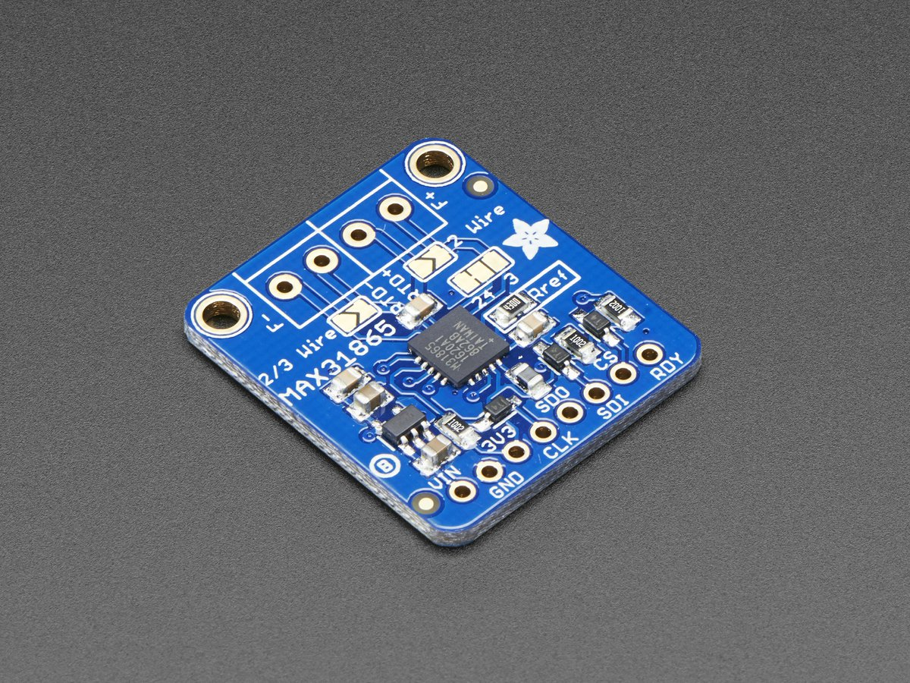

# Adafruit MAX31865 Java
This is the Adafruit MAX31865 Library for Raspberry Pi written in Java.

Tested and works great with the Adafruit MAX31865 Amplifier with PT1000 sensor on Raspberry Pi 3 B+.

   * <a href="http://www.adafruit.com/products/3328">http://www.adafruit.com/products/3328</a>
   * <a href="https://learn.adafruit.com/adafruit-max31865-rtd-pt100-amplifier/overview">https://learn.adafruit.com/adafruit-max31865-rtd-pt100-amplifier/overview</a>

This amplifier uses SPI to communicate. 2-4 pins are required to interface.

**Dependencies:** <a href="https://pi4j.com/1.2/index.html">https://pi4j.com/1.2/index.html</a>

* Pi4J - Core
* Pi4J - GPIO Extension
* Pi4J - Device

**Notes:**

* Check class level documentation for more details and usage `AdafruitMax31865.java`.
* This is a Maven project with included Pi4J dependencies.

*Written by Uros Krkic*

*MIT license*
